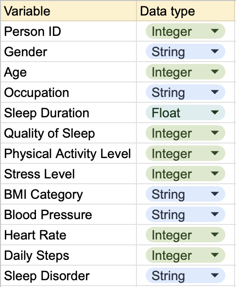
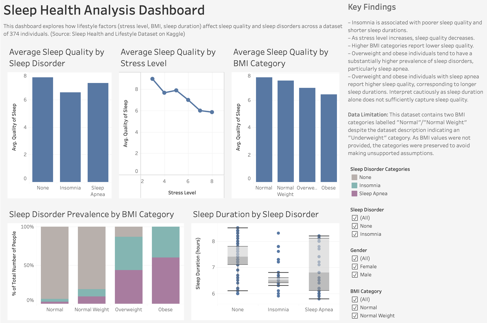
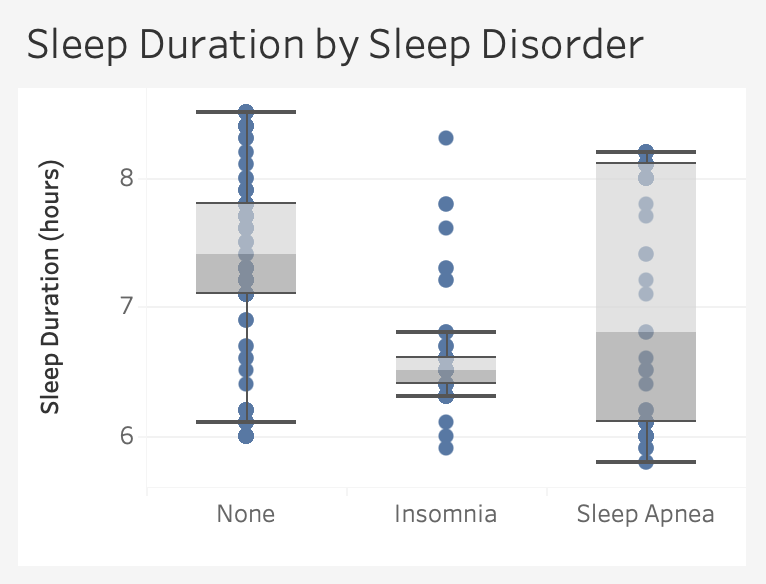
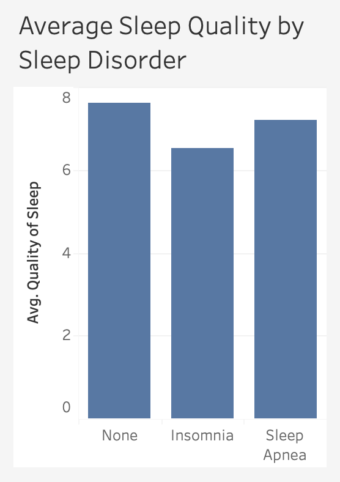
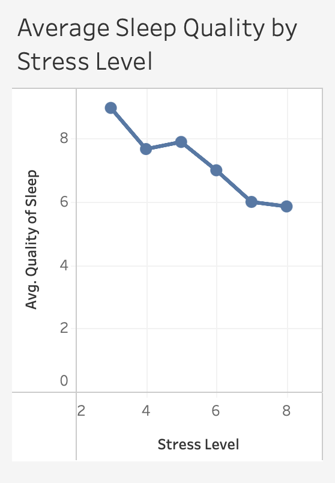
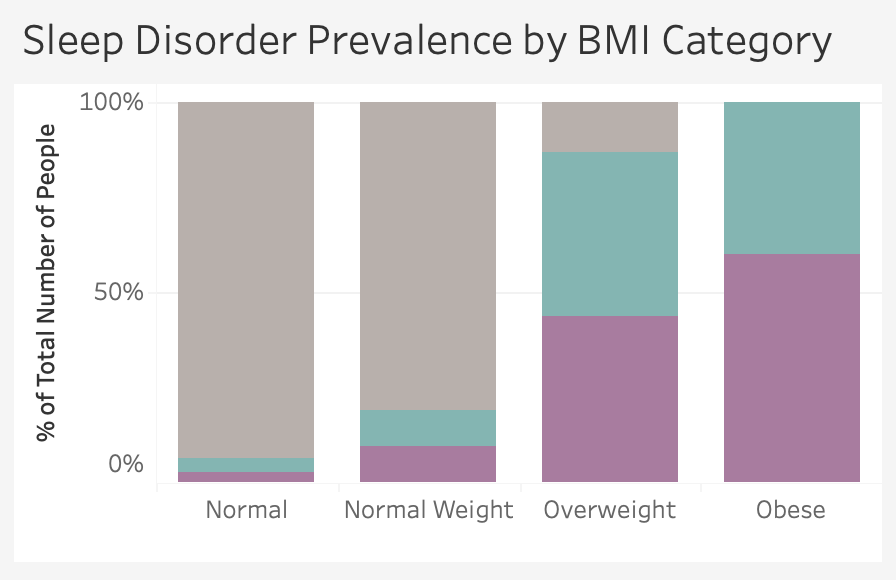
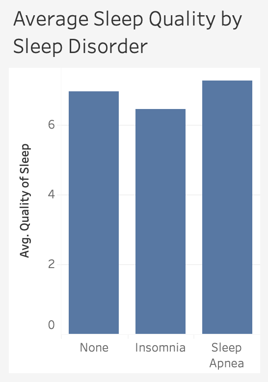

# Sleep Health and Lifestyle Analysis

## 1. Project Overview & Background
### Context and Goals
Sleep is a fundamental component of overall health, supporting cognitive function, emotional regulation and physical recovery. Even so, it is often overlooked by many due to reasons such as less awareness towards the implications of sleep deprivation, or choosing to sacrifice sleep for more “productive” time which in fact can be counterproductive. Examining the various factors that affect sleep health can better inform future health research, improve understanding of sleep behaviour and support public health initiatives.

This project explores the relationships between sleep health indicators, demographic characteristics and other health metrics using exploratory data analysis (EDA) in SQL and Tableau Public. 

## 2. Dataset Structure & Quality Checks
### Title: Sleep Health and Lifestyle Dataset (Sourced from Kaggle)
This dataset contains a row count of 374 records. The columns provide details on demographics, sleep metrics, health indicators and sleep disorder status for each observation corresponding to a unique identifier.

### Data Validation
1. The dataset contains two BMI categories labelled “Normal”/”Normal Weight” despite the dataset description indicating an “Underweight” category. Given that no numerical values for weight, height for BMI were provided, the categories have been preserved to avoid making unsupported assumptions. 
2. Duplicate checks found no repeated Person ID values, indicating that each record represents a unique individual. However, through manual checks, it was found that several observations shared identical attribute values while having different Person IDs. As this is a synthetic dataset created for illustrative purposes, these records were treated as distinct individuals and were retained in the analysis.

The SQL queries that were used to perform exploration, data validation and quality checks can be found [here](sql/exploration_and_validation.sql).

## 3. Methodology & Project Workflow
Tools used: SQLite, DB Browser for SQLite, Tableau Public, GitHub
### Workflow
- Browsed Kaggle for viable healthcare datasets
- Prepared GitHub and DB Browser for SQLite
- Wrote SQL queries for data exploration and analysis
- Ran through queries to prioritise Tableau visualisations 
- Interpreted visualisations and documented key findings
- Created and published dashboard on Tableau Public
- Wrote README

The SQL queries used for data analysis can be found [here](sql/analysis_queries.sql).

## 4. Executive Summary
### Overview of Key Findings
- Individuals with insomnia report shorter sleep durations and lower sleep quality compared to individuals with sleep apnea or without sleep disorders.
- Sleep quality demonstrates a clear negative relationship with stress levels.
- At higher BMI categories, there is generally lower sleep quality along with an increase in sleep disorder prevalence.

Below is a screenshot of the Tableau Public dashboard built based on the key findings stated. The entire interactive dashboard can be viewed [here](https://public.tableau.com/views/SleepHealthOverview_17823057861110/Dashboard1?:language=en-US&:sid=&:display_count=n&:origin=viz_share_link).

## 5. Insights Deep Dive
### 5.1 Insomnia and Overall Sleep Health

- (observation) Individuals diagnosed with insomnia report the shortest sleep durations and lowest sleep quality on average relative to individuals with sleep apnea or without sleep disorders.
- (interpretation) This observation suggests that insomnia is associated with both reduced sleep duration and poorer quality of sleep. It can also be inferred that sleep duration is a key contributing factor to measuring sleep quality. However, it is important to note that considering sleep duration alone is insufficient to determine sleep quality.
- (implications)

### 5.2 Stress Levels on Sleep Quality

- (observation) Sleep quality generally falls as stress levels increase, indicating a negative relationship between stress levels and sleep quality. 
- (interpretation) This consistently decreasing trend suggests that stress may be an important factor associated with overall sleep health. 
- (implications)

### 5.3 BMI and Sleep Disorders

- (observation) Overweight and obese individuals generally exhibit a substantially higher prevalence of sleep disorders. Additionally, in the Overweight and Obese categories, there is a slightly higher proportion of people with sleep apnea than with insomnia.
- (interpretation) This suggests that having a higher BMI is a possible contributing factor to the development of sleep apnea, albeit not the only factor.
- (implications)

### 5.4 Sleep Apnea and Reported Quality of Sleep

- (observation) Among the Overweight and Obese BMI categories, individuals with sleep apnea appear to have a higher reported sleep quality than those with insomnia or without diagnosed sleep disorders in the same BMI categories. 
- (interpretation) This is an unexpected finding that should be interpreted with caution. As the dataset is synthetic and only includes self-reported sleep quality, the available variables are insufficient to fully explain this observation. The data does not include additional clinical indicators (blood oxygen saturation and time spent in non-REM and REM stages of sleep) which would provide a more comprehensive assessment of sleep quality. 
- (implications)

## 6. Caveats and Assumptions
- Synthetic dataset – The dataset was created for illustrative purposes. As a result, there is a presence of several observations with identical attributes but different Person IDs, which may not accurately reflect real-world epidemiology.
- Correlation does not imply causation – The relationships identified in this analysis are correlational and should not be interpreted as evidence of causal relationships between the variables. 

## 7. Possible Improvements
(choose a larger dataset with more observations/additional sleep metrics)
